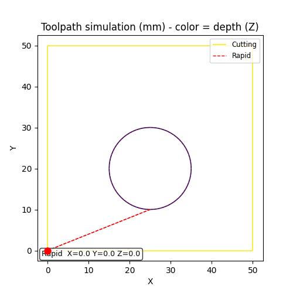

# SpiralPocket

A small Python tool that generates G-code for milling a rectangular pocket
using a square spiral toolpath, with a desktop GUI for building, previewing,
saving, and simulating the generated G-code. Built with LinuxCNC and
Fusion 360 workflows in mind, and aimed at people who are new to CNC.

> **Always inspect generated G-code in the Simulator tab, and dry-run it
> above the stock (or with the spindle off) before cutting real material.**
> This tool is provided as-is, with no warranty — see [LICENSE](LICENSE).
> You are responsible for verifying that the output is correct and safe for
> your machine, tooling, and material before running it.

## Demo

Loading a G-code file and running the toolpath simulator:


Simulator playback close-up:



## Features

- **Square spiral pocketing toolpath** — spirals inward from the stock
  boundary to the desired part size, shrinking by a configurable step-over
  per lap, with tool radius compensation.
- **Multi-pass Z stepdown** — optionally split the total cut depth into
  multiple passes.
- **Unit-aware** — generate G-code in mm (`G21`) or inches (`G20`).
- **LinuxCNC-friendly output** — saves as `.ngc`, includes a comment header
  with every parameter used (for traceability), a safe-start block
  (`G17 G40 G49 G54 G80 G90 G94`), spindle on/off, dwell, and safe-Z
  retracts. The tool plunges just outside the stock corner, never into
  material.
- **GUI (tkinter + matplotlib)**:
  - **Generator tab** — fill in stock/part dimensions, tool, feeds, speeds,
    and depths; live spiral preview; Generate, Save, Open, and Reset
    buttons.
  - **Simulator tab** — load any G-code file (including arcs via `G2`/`G3`)
    and play back the toolpath with a color-coded depth view, scrubbable
    progress bar, and adjustable playback speed.
  - **Open previously generated files** — re-loads the parameters from the
    comment header back into the form.

## Installation

You need Python 3 with tkinter, plus matplotlib.

**1. Get the code** — either clone with git:

```bash
git clone https://github.com/olsen842/SpiralPocket.git
cd SpiralPocket
```

or download the ZIP from GitHub (green **Code** button → **Download ZIP**)
and unpack it.

**2. Install the dependency:**

```bash
pip3 install -r requirements.txt
```

**3. Linux only** — tkinter is often a separate package. If you get
`ModuleNotFoundError: No module named 'tkinter'`, install it with your
package manager:

```bash
# Debian / Ubuntu / Mint (also most LinuxCNC installs):
sudo apt install python3-tk

# Fedora:
sudo dnf install python3-tkinter

# Arch:
sudo pacman -S tk
```

On Windows and macOS, tkinter ships with the standard Python installer
from [python.org](https://www.python.org/downloads/).

## Usage

Run the GUI:

```bash
python3 gui.py
```

Fill in your stock and part dimensions, tool diameter, feeds and speeds,
then **Preview** the toolpath, **Generate** the G-code, and **Save...** it
as a `.ngc` file you can open in LinuxCNC. The Simulator tab plays back
the toolpath so you can verify it before cutting.

Or use the generator as a library:

```python
from gcode_generator import create_contour_gcode

gcode = create_contour_gcode(
    x_start=0, y_start=0,
    total_width=205, total_height=205,
    desired_width=200, desired_height=200,
    cut_step=0.5,
    feed=100, rpm=1000,
    tool_diameter=10.0,
    cut_depth=6.0, pass_depth=2.0,
    units="mm",
)
print(gcode)
```

## Files

| File | Purpose |
| --- | --- |
| `gcode_generator.py` | Core spiral-toolpath and G-code generation logic |
| `gcode_parser.py` | Parses G-code (including arcs) for the simulator |
| `gui.py` | Tkinter/matplotlib GUI — Generator and Simulator tabs |
| `example_pocket.ngc` | Real output from `create_contour_gcode()` — a 200×200mm pocket in 205×205mm stock |
| `test_pattern.ngc` | Hand-written G-code (square + arcs) for exercising the Simulator's `G2`/`G3` arc support |

## Requirements

- Python 3 (with tkinter — see [Installation](#installation) for Linux)
- `matplotlib`

## License

MIT — see [LICENSE](LICENSE).
 
